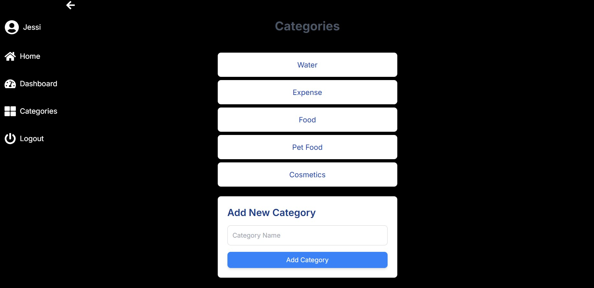
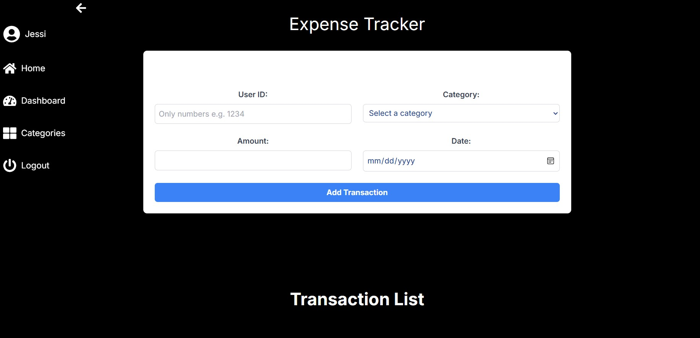
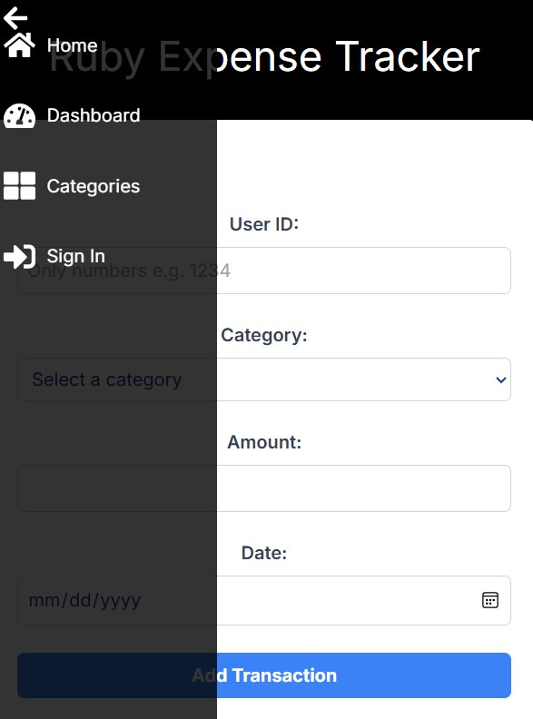

# Full Stack App





## Table of Contents
- [Introduction](#overview)
- [Title](#project-title)
- [Features](#features)
- [Requisites](#prerequisites)
- [Instructions](#setup-instructions)
- [Demo](#demo)

## Overview

This project is a full stack application developed using Next.js for the frontend, Node.js for the backend, and PostgreSQL for the database. It includes features for user authentication, data management, and interactive dashboards.

## Project Title

Real-Time Expense Tracker Dashboard for Ruby Card Users. This app allows Ruby Card users to track their expenses in real time.

## Features

- **Frontend**: Built with Next.js, supports server-side rendering and static site generation.
- **Backend**: Developed using Node.js and Express, handling API requests and server-side logic.
- **Database**: PostgreSQL for data storage and management.
- **User Authentication**: Secure user sign-up, login, and session management.
- **Interactive Dashboard**: Visual representation of user data with charts and graphs.

## Prerequisites

- Node.js (v18 or later)
- npm (v8 or later)
- PostgreSQL
- TailwindCSS
- Clerk
- PostgreSQL

## Setup Instructions

### 1. .env
```bash
.env

JWT_SECRET= Your key
NEXT_PUBLIC_CLERK_PUBLISHABLE_KEY= Your key
CLERK_SECRET_KEY= Your key
```

### 2. install dependencies

```bash
npm install
```
### 3. Prepare the frontend

```bash
cd ruby
npm run dev
```
### 4. Prepare the backend

```bash
nodemon server.js
```

## Demo


